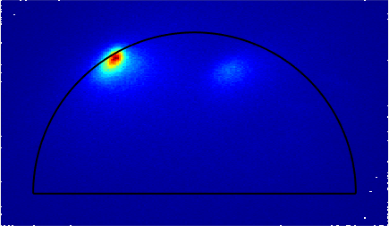
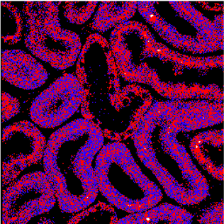
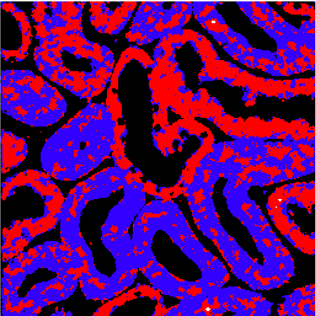

# Frontiers FLIM Denoising
This is the folder contains all the results used in the SPIE CNN based FLIM denoising paper.

#For image denoising using ImageJ: 
https://github.com/ND-HowardGroup/Instant-Image-Denoising

#For K-means segmentation: 
https://github.com/ND-HowardGroup/Kmeans-FLIM-Phasors

## Phasor images
Noisy Input phasor: 3D zebrafish sample

Denoised Output Phasor: From Neural network: 

## Image segmentation: K-means clustering
Noisy segments: 2D Mouse Kidney shows the microtubules

Denoised segments:

## Dataset:
#Images: The testing dataset of Zebrafish and mouse kidney images are given in this folder and for the BAPE sample images can be downloaded from here https://curate.nd.edu/show/mw22v40954f

#Citation for dataset: Please cite the Fluorescence Microscopy Lifetime Denoising (FMLD) dataset using the following format: Mannam, Varun. 2020. “Fluorescence Microscopy Lifetime Denoising (FMLD) Dataset.” Notre Dame. https://doi.org/10.7274/r0-18da-9m58.

## **Copyright**

© 2019 Varun Mannam, University of Notre Dame  

## **License**

Licensed under the [GPL](https://github.com/ND-HowardGroup/Frontiers-FLIM-Denoising/blob/main/LICENSE)
