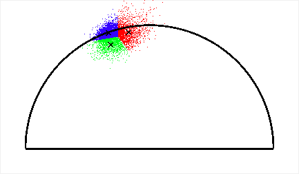

# Frontiers FLIM Denoising
This is the folder contains all the results used in the pre-trained CNN for FLIM lifetime denoising and phasor denoising.

# Installation of the plugins
[Simple Instructions](https://github.com/ND-HowardGroup/Instant-Image-Denoising/blob/master/Plugins/Instructions_to_Install_Image_denoising_plugins.docx)

#For fluoresence microscopy image denoising using ImageJ plugin: 
https://github.com/ND-HowardGroup/Instant-Image-Denoising

We use these (DnCNN and Noise2Noise) CNN models as pre-trained CNNs for denoising FLIM lifetime and phasor denoising. 

#For K-means segmentation: 
https://github.com/ND-HowardGroup/Kmeans-FLIM-Phasors

## Phasor images
Noisy Input phasor: 3D zebrafish sample

Denoised Output Phasor: From Neural network: 

## Image segmentation: K-means clustering
Noisy segments: 2D Mouse Kidney shows the microtubules

Denoised segments: 2D Mouse Kidney shows the microtubules show the upstream and downstream microtubules.

# Results shown in the Journal paper
Details: plant sample1
Input: 2D single channel image from plant images dataset: (from our custom made InstantFLIM FD-MPM-FLIM system at excitaiton: 800nm and sample: bean leaf plant in vivo imaging)
Denoised: Image denoising using our ImageJ plugin (using pre-trained DnCNN CNN model): (time: 80 ms in GPU, image size: 512x512)
Target: Target image generated by taking average of 5 noisy images in the same FOV: 

Input Noisy HSV lifetime       | Median HSV filtering  | DnCNN HSV denoising       | Target HSV lifetime       |	
:-------------------------:|:-------------------------:|:-------------------------:|:-------------------------:|
   |  |  | |

Input Noisy lifetime       | Median filtering          | DnCNN denoising Plugin    | Target Image 		         |	
:-------------------------:|:-------------------------:|:-------------------------:|:-------------------------:|
   |  |  | |

Input Noisy lifetime histogram      | Median  filtering  | DnCNN denoising       | Target HSV lifetime       |	
:-------------------------:|:-------------------------:|:-------------------------:|:-------------------------:|
   |  |  | |

Input Noisy HSV lifetime       | Median HSV filtering  | DnCNN HSV denoising       | Target HSV lifetime       |	
:-------------------------:|:-------------------------:|:-------------------------:|:-------------------------:|
   |  |  | |

**Details: plant sample2**
Input: 2D single channel image from plant images dataset: upper epidermis layer: (from our custom made InstantFLIM FD-MPM-FLIM system at excitaiton: 800nm and sample: bean leaf plant in vivo imaging)
Denoised: Image denoising using our ImageJ plugin (using pre-trained DnCNN CNN model): (time: 80 ms in GPU, image size: 512x512)
Target: Target image generated by taking average of 5 noisy images in the same FOV: 
Input Noisy HSV lifetime       | Median HSV filtering  | DnCNN HSV denoising       | Target HSV lifetime       |	
:-------------------------:|:-------------------------:|:-------------------------:|:-------------------------:|
   |  |  | |

Input Noisy lifetime       | Median filtering          | DnCNN denoising Plugin    | Target Image 		         |	
:-------------------------:|:-------------------------:|:-------------------------:|:-------------------------:|
   |  |  | |

Input Noisy HSV lifetime       | Median HSV filtering  | DnCNN HSV denoising       | Target HSV lifetime       |	
:-------------------------:|:-------------------------:|:-------------------------:|:-------------------------:|
   |  |  | |

**Details: BPAE sample1**
Input: 2D single channel image from BPAE images: (from our custom made InstantFLIM FD-MPM-FLIM system at excitaiton: 800nm and sample: BPAE ex vivo imaging)
Denoised: Image denoising using our ImageJ plugin (using pre-trained DnCNN CNN model): (time: 80 ms in GPU, image size: 512x512)
Target: Target image generated by taking average of 5 noisy images in the same FOV: 
Input intensity            | Noisy HSV lifetime        | DnCNN HSV denoising       | Target HSV lifetime       |	
:-------------------------:|:-------------------------:|:-------------------------:|:-------------------------:|
   |  |  | |

Noisy lifetime Phasor       | DnCNN lifetime Phasor    | Target lifetime Phasor    |	
:-------------------------:|:-------------------------:|:-------------------------:|
   |  |  |

**Details: Mouse Kidney sample1**
Input: 2D single channel image from fixed Mouse Kidney images: (from our custom made InstantFLIM FD-MPM-FLIM system at excitaiton: 800nm and sample: fixed mouse kideny ex vivo imaging)
Denoised: Image denoising using our ImageJ plugin (using pre-trained DnCNN CNN model): (time: 80 ms in GPU, image size: 512x512)
Target: Target image generated by taking average of 5 noisy images in the same FOV: 

Input intensity            | Noisy HSV lifetime        | DnCNN HSV denoising       | Target HSV lifetime       |		
:-------------------------:|:-------------------------:|:-------------------------:|:-------------------------:|
   |  |  | |

Noisy lifetime Phasor       | DnCNN lifetime Phasor    | Target lifetime Phasor    |	
:-------------------------:|:-------------------------:|:-------------------------:|
   |  |  |

**Details: BPAE sample3: large FOV**
Input: 2D single channel image from BPAE images: (from our custom made InstantFLIM FD-MPM-FLIM system at excitaiton: 800nm and sample: BPAE ex vivo imaging)
Denoised: Image denoising using our ImageJ plugin (using pre-trained DnCNN CNN model): (time: 80 ms in GPU, image size: 512x512)
Target: Target image generated by taking average of 5 noisy images in the same FOV: 
Input intensity            | Noisy HSV lifetime        | DnCNN HSV denoising       | Target HSV lifetime       |	
:-------------------------:|:-------------------------:|:-------------------------:|:-------------------------:|
   |  |  | |

**Details: Mouse Kidney sample4: large FOV**
Input: 2D single channel image from fixed Mouse Kidney images: (from our custom made InstantFLIM FD-MPM-FLIM system at excitaiton: 800nm and sample: fixed mouse kideny ex vivo imaging)
Denoised: Image denoising using our ImageJ plugin (using pre-trained DnCNN CNN model): (time: 80 ms in GPU, image size: 512x512)
Target: Target image generated by taking average of 5 noisy images in the same FOV: 

Input intensity            | Noisy HSV lifetime        | DnCNN HSV denoising       | Target HSV lifetime       |		
:-------------------------:|:-------------------------:|:-------------------------:|:-------------------------:|
   |  |  | |

# Noise2Noise pre-trained CNN results

Details: 
Input: 2D single channel FLIM image of FLIM BPAE sample captured using our Instant FLIM system:
FLIM Image denoising using our ImageJ plugin (from trained Noise2Noise ML model): (time: 80 ms in GPU, image size: 512x512)
Target: Target image generated by taking average of 5 noisy images in the same FOV: 

## Dataset:
#Images: The testing dataset of in vivo Zebrafish and in vio mouse kidney images are given in this folder and for the BAPE sample images can be downloaded from here https://curate.nd.edu/show/mw22v40954f
Additional images are added from the instant FLIM and commertial FLIM systems in the datasets folder. Fixed BPAE cells and fixed mouse kidney cells are imaged using Instant FLIM system the data is provided in the Datasets folder. 

#Citation for dataset: Please cite the Fluorescence Microscopy Lifetime Denoising (FMLD) dataset using the following format: Mannam, Varun. 2020. “Fluorescence Microscopy Lifetime Denoising (FMLD) Dataset.” Notre Dame. https://doi.org/10.7274/r0-18da-9m58.

## **Copyright**

© 2019 Varun Mannam, University of Notre Dame  

## **License**

Licensed under the [GPL](https://github.com/ND-HowardGroup/Frontiers-FLIM-Denoising/blob/main/LICENSE)
